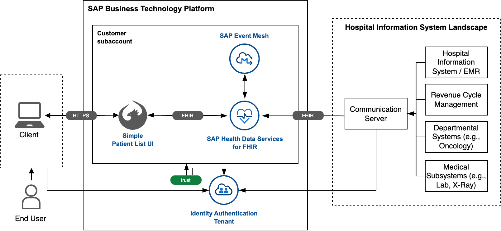

# SAP Health Data Services for FHIR - SAP Discovery Center Missions and Reusable Content

## Description

This repository provides an overview of the released and planned SAP Health Data Services for FHIR missions, and includes content that can be reused by them.

Here is an overview of the missions, related to SAP Health Data Services for FHIR:
* Get Started with SAP Health Data Services for FHIR

### SAP BTP Solution Diagram

## Requirements

To start with the setup of SAP Health Data Services for FHIR (Beta), you must have completed the prerequisites in [Initial Setup](https://help.sap.com/docs/SAP_HEALTH_DATA_SERVICES_FOR_FHIR/f64d5f2b858042f791b64bdd4094df22/872ceb743a38498bb960b916de6cde5d.html?locale=en-US). The mission will guide you through this process.

## Download and Installation

## Known Issues

No known issues.

## How to obtain support

You can report an incident or error through the [SAP Support Portal](https://support.sap.com/en/index.html). Please use the respective component for your incident, as described in the [documentation](https://help.sap.com/docs/SAP_HEALTH_DATA_SERVICES_FOR_FHIR/f64d5f2b858042f791b64bdd4094df22/2fe94484269e487ea72a35befbe0a02b.html?locale=en-US).
When submitting the incident, we recommend you to include the following information:
-	Landscape information (for example, EU10)
-	The URL of the page where the incident or error occurs
-	The steps or clicks used to replicate the error
-	Screenshots, videos, or the code entered

[Create an issue](https://github.com/SAP-samples/health-data-services-mission/issues) in this repository if you find a bug or have questions about the content.
 
For additional support, [ask a question in SAP Community](https://answers.sap.com/questions/ask.html).

## Contributing
If you wish to contribute code, offer fixes or improvements, please send a pull request. Due to legal reasons, contributors will be asked to accept a DCO when they create the first pull request to this project. This happens in an automated fashion during the submission process. SAP uses [the standard DCO text of the Linux Foundation](https://developercertificate.org/).

## License
Copyright (c) 2023 SAP SE or an SAP affiliate company. All rights reserved. This project is licensed under the Apache Software License, version 2.0 except as noted otherwise in the [LICENSE](LICENSE) file.
